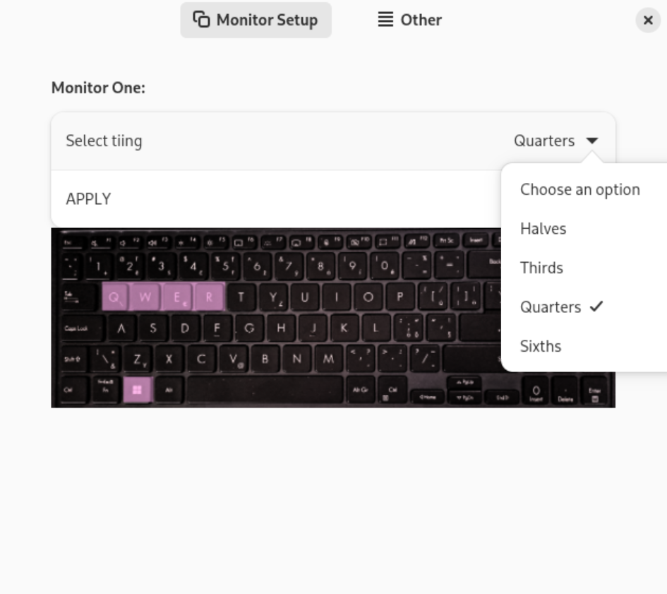

# HELPING TILER 📄

This is **Helping Tiler**, a gnome extension designed to help tile windows in an easy and clean way with no irrelevant bloat 🦐

It already works well enough for my limited personal use but there is a lot of work to be done, see **issues** 🐡

**BEFORE YOU BEGIN:**

Reaching / place to save the extension: cd .local/share/gnome-shell/extensions/tiling_helper@helping_tiler
Starting nested shell on Wayland: dbus-run-session -- gnome-shell --nested --wayland  
Recompiling schema: glib-compile-schemas schemas/
